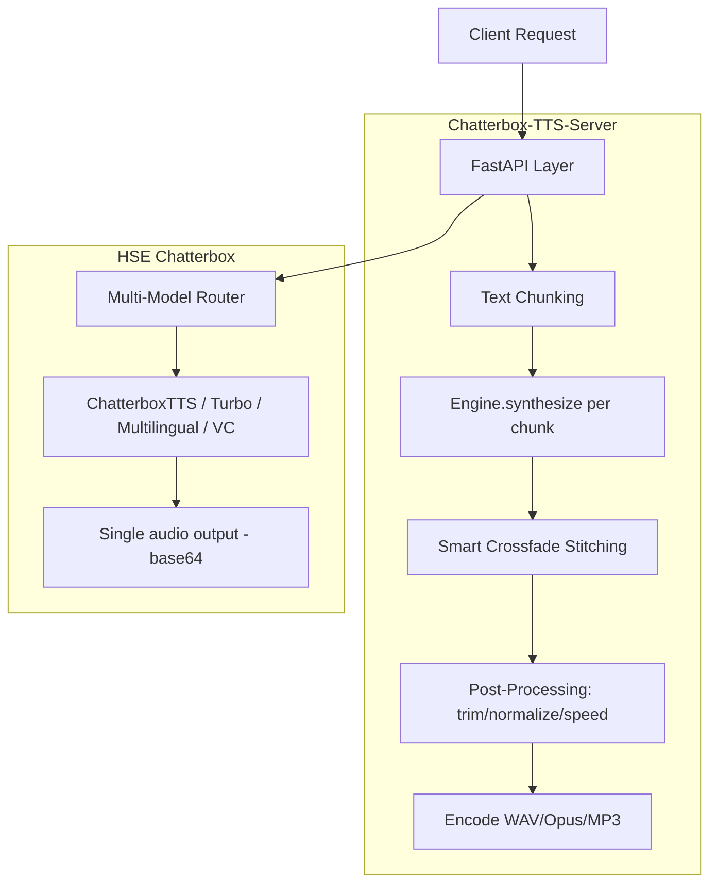

## Feature Gap Analysis: Chatterbox TTS Server vs HSE Chatterbox Implementation

### What HSE Already Has ✅

HSE's Chatterbox integration is actually quite sophisticated in areas the external server doesn't cover at all:

- All **4 model variants**: [`ChatterboxTTS`](harmonyspeech/modeling/models/chatterbox/chatterbox.py:79), [`ChatterboxTurboTTS`](harmonyspeech/modeling/models/chatterbox/chatterbox.py:104), [`ChatterboxMultilingualTTS`](harmonyspeech/modeling/models/chatterbox/chatterbox.py:189), [`ChatterboxVC`](harmonyspeech/modeling/models/chatterbox/chatterbox.py:230)
- Full **multi-step voice cloning pipeline** (`input_audio` → embed → TTS) via engine orchestration
- **Precomputed embedding reuse** (`input_embedding` bypass) — more efficient than the external server which always computes from audio
- All **Chatterbox-specific generation parameters** (`exaggeration`, `cfg_weight`, `temperature`, `top_p`, `min_p`, `top_k`, `norm_loudness`, `repetition_penalty`) with per-variant validation in [`inputs.py`](harmonyspeech/task_handler/inputs.py:661)
- **Multi-model routing/orchestration** across models and pipelines
- **Base64 audio I/O** (fully API-native, no filesystem coupling)
- **23-language multilingual variant** support
- **Voice ID routing** and **language-aware routing**

---

### What HSE is Missing — Feature Gaps ❌

#### 🔴 High Value — Core Audio Quality

| Gap | Details in Chatterbox-TTS-Server | HSE Status |
|---|---|---|
| **Text chunking / splitting for long inputs** | [`server.py:907`](.current_work/Chatterbox-TTS-Server/server.py:907) splits text by sentences via `chunk_text_by_sentences()` before synthesis | No chunking logic in HSE TTS serving layer; long text sent as a single inference call |
| **Smart audio stitching with crossfading** | [`server.py:1041`](.current_work/Chatterbox-TTS-Server/server.py:1041) — equal-power crossfade curves (cos²/sin²) overlap adjacent chunks with configurable silence padding between sentences | HSE has no multi-chunk assembly; no crossfade |
| **Post-generation speed factor** | [`utils.py`](.current_work/Chatterbox-TTS-Server/utils.py) uses librosa time-stretching (pitch-preserving) at configurable factors 0.25–4.0x | `speed` exists in [`GenerationOptions`](harmonyspeech/endpoints/openai/protocol.py:54) but no implementation in Chatterbox runner |
| **Peak normalization / clip prevention** | [`server.py:1110`](.current_work/Chatterbox-TTS-Server/server.py:1110) — auto-normalizes if peak > 0.99 threshold | No audio post-processing of this kind in HSE |

#### 🟡 Medium Value — Audio Enhancement (Post-Processing)

| Gap | Details in Chatterbox-TTS-Server | Notes |
|---|---|---|
| **Lead/trail silence trimming** | `trim_lead_trail_silence()` — configurable via `audio_processing.enable_silence_trimming` | Useful for clean TTS clips |
| **Internal silence reduction** | `fix_internal_silence()` — shortens unnaturally long internal pauses | Improves naturalness |
| **DC offset removal** | `_remove_dc_offset()` — 2nd-order Butterworth high-pass @ 15 Hz, prevents low-freq thumps at chunk joins | Particularly relevant when stitching chunks |
| **Unvoiced segment removal** | `remove_long_unvoiced_segments()` via `praat-parselmouth` — optional, removes non-speech regions | Low priority, optional dependency |

#### 🟠 Operational / Infrastructure

| Gap | Details in Chatterbox-TTS-Server | Notes |
|---|---|---|
| **Reference audio validation** | [`server.py:664`](.current_work/Chatterbox-TTS-Server/server.py:664) validates duration and format before sending to engine | HSE accepts raw base64 without pre-validation |
| **Predefined voices library** | 28 built-in voices (`.wav` files in `voices/`) served as named IDs; upload endpoints for user-defined voices | HSE has no "named voice file library" concept |
| **Voice file upload endpoints** | `POST /upload_reference` and `POST /upload_predefined_voice` with validation | No file management API in HSE |
| **MP3 output format** | [`models.py:64`](.current_work/Chatterbox-TTS-Server/models.py:64) adds `mp3` alongside `wav` and `opus` | [`AudioOutputOptions`](harmonyspeech/endpoints/openai/protocol.py:93) only lists format as free string — MP3 encoding not wired |
| **Performance monitoring per request** | `PerformanceMonitor` class records timing at each step (chunking, synthesis per chunk, stitching, encoding) | HSE has request-level metrics but no per-step TTS timing |
| **Model hot-swap without restart** | [`server.py:562`](.current_work/Chatterbox-TTS-Server/server.py:562) `reload_model()` unloads + reloads without process restart | HSE requires full restart for model changes |

---

### Architecture Comparison

---

### Prioritized Recommendations

Based on value vs implementation effort, here is the priority ordering:

**Phase A — Core Audio Quality (highest bang for buck)**

1. **Text chunking + smart audio stitching** — This is the biggest functional gap. Long texts sent to Chatterbox without chunking risk degraded quality or OOM. The external server's crossfade approach (equal-power curves) with sentence-boundary awareness is the right solution. This would live in [`serving_text_to_speech.py`](harmonyspeech/endpoints/openai/serving_text_to_speech.py) or a new `audio_utils.py`.
2. **Speed factor post-processing** — Wire up the existing `speed` field in [`GenerationOptions`](harmonyspeech/endpoints/openai/protocol.py:54) to a librosa pitch-preserving time-stretch in the Chatterbox execution path in [`model_runner_base.py`](harmonyspeech/task_handler/model_runner_base.py:666).
3. **Peak normalization** — Simple to add; prevents clipping artifacts especially after stitching chunks.

**Phase B — Audio Enhancement (quality polish)**

4. **Lead/trail silence trimming** — Configurable per request or globally via engine config
5. **DC offset removal** — Directly supports Phase A (chunk stitching quality)
6. **Internal silence reduction** — Optional; could be a `post_generation_filters` pipeline step

**Phase C — Infrastructure (operational improvements)**

7. **Reference audio validation** — Validate duration and format of `input_audio` before invoking the embedding step
8. **MP3 output format** — Add MP3 encoding support to the audio output pipeline
9. **Predefined voices library** — Conceptually maps to file-backed voice IDs in config; needs design discussion
