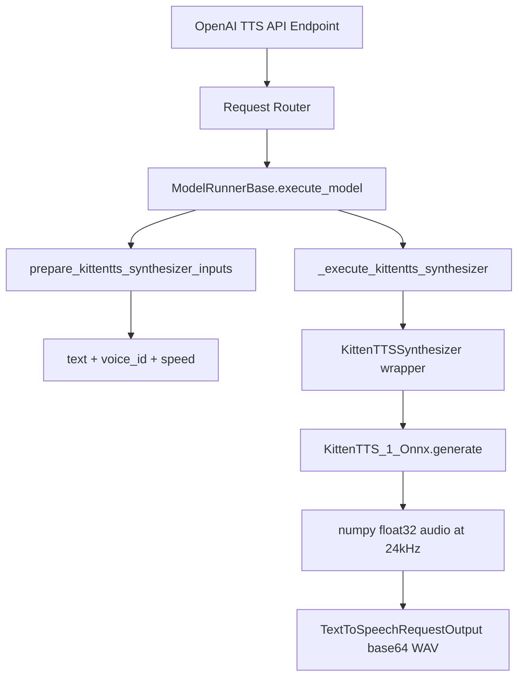

# KittenTTS Integration for Harmony Speech Engine

## Overview

KittenTTS is an ultra-lightweight ONNX-based TTS model (15–80M parameters, 25–80MB) by KittenML. It uses `onnxruntime` for CPU-optimized inference with `misaki`/`espeak` phonemization. This plan integrates it into HSE following the existing **native model pattern** (same as FasterWhisper and SileroVAD), since KittenTTS manages its own model download and initialization via the `huggingface_hub` and `onnxruntime` APIs directly.

### Key Properties of KittenTTS

- **ONNX runtime inference** – CPU-optimized, no PyTorch model weights
- **Model variants**: `kitten-tts-mini-0.8` (80MB), `kitten-tts-micro-0.8` (41MB), `kitten-tts-nano-0.8-fp32` (56MB), `kitten-tts-nano-0.8-int8` (25MB)
- **Voices**: Bella, Jasper, Luna, Bruno, Rosie, Hugo, Kiki, Leo (8 voices)
- **Audio output**: 24,000 Hz, mono, float32
- **Language**: English only (current release)
- **Dependencies**: `onnxruntime`, `misaki[en]`, `espeakng_loader`, `num2words`, `spacy`, `soundfile`

### Integration Approach

KittenTTS follows the **native model** pattern:
- No config.json needed from HuggingFace (model downloads ONNX + voices.npz itself)
- Model type: `KittenTTSSynthesizer`
- The KittenTTS source code from `.current_work/KittenTTS/kittentts/` is copied into `harmonyspeech/modeling/models/kittentts/`
- A `KittenTTSSynthesizer` wrapper class is created that holds the `KittenTTS_1_Onnx` instance and exposes a `generate()` method
- Voice selection maps the friendly name (e.g. `"Jasper"`) to the internal voice alias

---

## Implementation Status

Track the completion of each phase as implementation progresses:

- [x] **Phase 1: KittenTTS Model Module** ([1-KittenTTSModelModule.md](1-KittenTTSModelModule.md))
- [x] **Phase 2: Model Registry Registration** ([2-ModelRegistryRegistration.md](2-ModelRegistryRegistration.md))
- [x] **Phase 3: Loader Integration** ([3-LoaderIntegration.md](3-LoaderIntegration.md))
- [x] **Phase 4: Input Preparation Handler** ([4-InputPreparationHandler.md](4-InputPreparationHandler.md))
- [x] **Phase 5: Model Runner Execution Handler** ([5-ModelRunnerExecutionHandler.md](5-ModelRunnerExecutionHandler.md))
- [x] **Phase 6: Configuration Examples** ([6-ConfigurationExamples.md](6-ConfigurationExamples.md))
- [-] **Phase 7: Dependencies Update** ([7-DependenciesUpdate.md](7-DependenciesUpdate.md))
- [ ] **Phase 8: Documentation Update** ([8-DocumentationUpdate.md](8-DocumentationUpdate.md))

---

## Architecture Overview

## Files to Create

| File | Purpose |
|------|---------|
| `harmonyspeech/modeling/models/kittentts/__init__.py` | Package init + exports |
| `harmonyspeech/modeling/models/kittentts/onnx_model.py` | KittenTTS_1_Onnx from source |
| `harmonyspeech/modeling/models/kittentts/preprocess.py` | TextPreprocessor from source |
| `harmonyspeech/modeling/models/kittentts/kittentts.py` | KittenTTSSynthesizer wrapper |

## Files to Modify

| File | Change |
|------|--------|
| `harmonyspeech/modeling/models/__init__.py` | Register `KittenTTSSynthesizer` |
| `harmonyspeech/modeling/loader.py` | Add native config/weights entries + top-level import + model init bailout |
| `harmonyspeech/task_handler/inputs.py` | Add `prepare_kittentts_synthesizer_inputs()` + dispatch case |
| `harmonyspeech/task_handler/model_runner_base.py` | Add `_execute_kittentts_synthesizer()` + dispatch |
| `harmonyspeech/endpoints/openai/serving_text_to_speech.py` | Add `"KittenTTSSynthesizer"` to `_TTS_MODEL_TYPES` |
| `config.yml` | Add example KittenTTS model configs |
| `docker/nvidia/Dockerfile` | Add `espeak-ng` system package |
| `docker/amd/Dockerfile` | Add `espeak-ng` system package |
| `docker/cpu/Dockerfile` | Add `espeak-ng` system package |
| `requirements-common.txt` | Add `onnxruntime`, `misaki[en]>=0.9.4`, `espeakng_loader`, `num2words`, `spacy` |
| `docs/models.md` | Document KittenTTS models |
| `CHANGELOG.md` | Add changelog entry |
