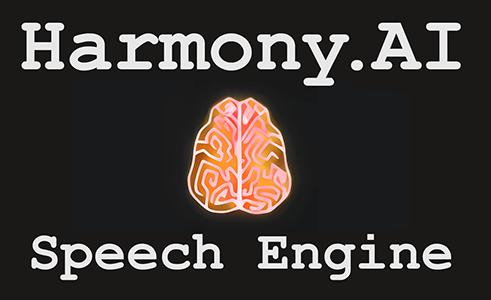
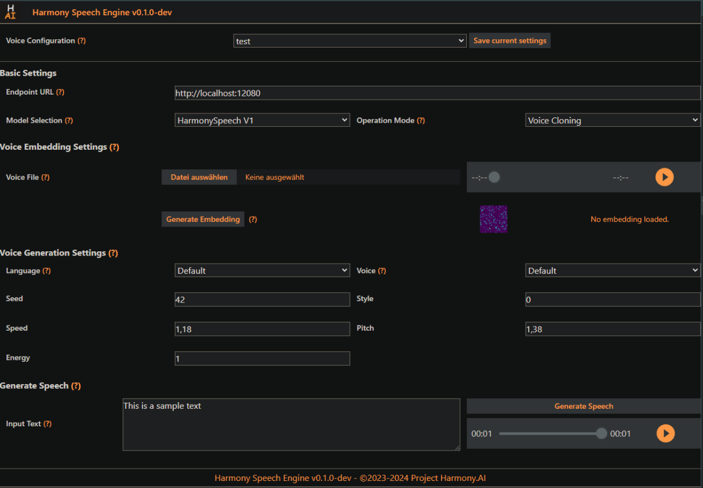

# Project Harmony.AI - Harmony Speech Engine

---

Harmony.AI's Speech Engine is a high performance inference engine for Open Source Speech AI.

It's goal is to serve as the backbone for cost-efficient local and self-hosted AI Speech Services, supporting
a variety of Speech-related model architectures for Text-To-Speech, Speech-To-Text and Voice Conversion.

#### - Currently under Development - 
#### Help is appreciated and highly welcome! See Open ToDo's below -

## Core Features
- [OpenAI-Style APIs](docs/api.md) for Text-to-Speech, Speech-To-Text, Voice Conversion and Speech Embedding.
- Multi-Model & Parallel Model Processing Support (See [Models](docs/models.md)).
- Toolchain-based request processing & internal re-routing between models working together (See [Routing](docs/routing.md)).
- GPU & CPU Inference
- Huggingface Integration
- Interactive UI
- Docker Support



---

## Quickstart

### Running with Docker

For instructions on how to set up and run Harmony Speech Engine using Docker, please refer to the [Docker Setup Guide](docs/docker.md).

### Running locally 
#### 1. Set up the base environment
<details>
<summary>
Instructions for Setting up the base environment 
</summary>

#### 1. Install Python
We recommend using a package manager like [miniconda](https://docs.anaconda.com/miniconda/). Current version is tested with Python 3.12:
```
conda create -n hse python=3.12
conda activate hse
```

#### 2. Install Pytorch
| System | GPU | Command |
|--------|---------|---------|
| Linux/WSL | NVIDIA | `pip3 install torch==2.4.1 torchvision==0.19.1 torchaudio==2.4.1 --index-url https://download.pytorch.org/whl/cu121` |
| Linux/WSL | CPU only | `pip3 install torch==2.4.1 torchvision==0.19.1 torchaudio==2.4.1 --index-url https://download.pytorch.org/whl/cpu` |
| Linux | AMD | `pip3 install torch==2.4.1 torchvision==0.19.1 torchaudio==2.4.1 --index-url https://download.pytorch.org/whl/rocm6.1` |
| MacOS + MPS | Any | `pip3 install torch==2.4.1 torchvision==0.19.1 torchaudio==2.4.1` |
| Windows | NVIDIA | `pip3 install torch==2.4.1 torchvision==0.19.1 torchaudio==2.4.1 --index-url https://download.pytorch.org/whl/cu121` |
| Windows | CPU only | `pip3 install torch==2.4.1 torchvision==0.19.1 torchaudio==2.4.1` |

The up-to-date commands can be found here: https://pytorch.org/get-started/locally/.

#### 3. Clone Repository & Install Requirements:
```
git clone https://github.com/harmony-ai-solutions/harmony-speech-engine
cd harmony-speech-engine
pip install -r requirements
```

#### 4. Set up NodeJS for the Frontend
```
conda install conda-forge::nodejs
cd frontend
npm -i
```
</details>

#### 2. Check `config.yml` is correctly set up for the models you want to use (See [Models](docs/models.md)).

#### 3. Run Harmony Speech Engine from repo base directory:
```
python harmonyspeech/endpoints/cli.py run --host 0.0.0.0 --port 12080
```
Once started, you can access the API via http://127.0.0.1:12080. [Swagger](http://127.0.0.1:12080/docs) and [ReDoc](http://127.0.0.1:12080/redoc) are now also available for interactive Documentation.

For more details about the API & generating OpenAPI clients, please check our [API Documentation](docs/api.md).

#### 4. Run the Frontend
```
cd frontend
npm run dev
```
This will start a vite server accessible via http://localhost:5173/

#### 5. If you encounter any bugs, please create a Github Issue describing the problems you're facing. We're happy to help. :-) 

---

## Introduction
The goal of this engine is to provide a reliable and easy-to-maintain service which can be used for deploying Open Source
AI Speech technologies. Each of these Technologies have different setup requirements and pre-conditions, so the goal of
this project is to unify these requirements in a way so these technologies can work together seamlessly.

Aside from providing a runtime for these technologies behind a unified service API, the Harmony Speech Engine also
allows for recombining different technologies on-the-fly, to reduce processing duration and latency. For example, you
can generate Speech using a TTS integration, and then apply additional filtering using voice conversion (TBD).

The rough Idea for this project is to become something like [vLLM](https://github.com/vllm-project/vllm) / [Aphrodite Engine](https://github.com/PygmalionAI/Aphrodite-engine)
for AI Speech Inference. Significant parts of the codebase have been forked from Aphrodite engine, with a couple
modifications to allow for the intended Speech related use cases.
Support and Ideas for Improving this Project are very welcome.

### Differences from forked [Aphrodite Engine](https://github.com/PygmalionAI/Aphrodite-engine)
- Per-Request processing, instead of token sequence batching
- Support for loading and executing multiple models in parallel
- No *distributed* execution of single models (i.e. sharding); to reduce complexity - might be added later.
- No general quantization; if quantization is supported, this will be part of the individual model config.
- No Neuron Device Type Support (I don't have the means to test it properly; feel free to add support for it if you like)

### Planned and availiable Integrations
The following Technologies and Features are planned to be supported.
May change over time as new models and frameworks are being developed.

- [x] Zero-Shot Voice Conversion
  - [ ] NaturalSpeech3 Voice Converter
  - [x] OpenVoice V1 Tone Converter
  - [x] OpenVoice V2 Tone Converter
- [ ] Multi-Shot Voice Conversion
  - [ ] StyleTTS 2 Voice Converter
  - [ ] RVC (Retrieval-base-Voice-Conversion)
- [ ] Multi-Shot Voice Cloning
  - [ ] StyleTTS 2
- [x] Zero-Shot Voice Cloning
  - [x] Harmony Speech V1 (english)
  - [x] OpenVoice V1 (English / Chinese + basic emotions)
  - [x] OpenVoice V2 (English, Spanish, French, Chinese, Japanese and Korean)
  - [ ] Vall-E-X (Multilingual)
  - [ ] XTTS V2 (Multilingual)
  - [ ] CosyVoice (Multilingual)
- [x] Generic High Quality Single-Speaker TTS
  - [x] OpenVoice V1 (English / Chinese + basic emotions)
  - [x] OpenVoice V2 / MeloTTS (English, Spanish, French, Chinese, Japanese and Korean)
- [ ] Generic Multispeaker TTS
  - [ ] EmotiVoice (English / Chinese + basic emotions for a wide range of speakers)
- [ ] Adaptive Voice Cloning
  - [ ] Basic Overlays (TTS + Voice Conversion)
  - [ ] Embedding Vector Matching (Convenience Feature)
- [x] Automatic Speech Recognition & Language Detection
  - [x] Faster-Whisper / Faster-Distil-Whisper
  - [ ] Silero VAD
  - [ ] SenseVoice

## Open ToDo's & things that require work
- Documentation
  - [ ] Secondary Features: 
    - [ ] Pre-/Post-Processing
    - [ ] Output Formats
  - [ ] API Documentation
  - [ ] Internal Re-Routing mechanics
- Models and Features
  - [ ] StyleTTS 2 (TTS & Voice Conversion)
  - [ ] XTTS V2
  - [ ] Vall-E-X
  - [ ] EmotiVoice
  - [ ] Silero VAD
  - [ ] Input Pre-Processing
  - [ ] Post-Processing / Overlays
  - [ ] Output Format Customization
  - [ ] Batching behaviour
  - [ ] TTS-Streaming
  - [ ] More comprehensive approach to internal Re-Routing of Requests 
- Testing & Operation
  - [ ] Unit Testing & Test mocking for Key Components
  - [ ] API Integration Tests
  - [ ] Input Audio File Format Support
  - [ ] Compatibility Testing for all APIs and Models

---

## About Project Harmony.AI

### Our goal: Elevating Human <-to-> AI Interaction beyond known boundaries.
Project Harmony.AI emerged from the idea to allow for a seamless living together between AI-driven characters and humans.
Since it became obvious that a lot of technologies required for achieving this goal are not existing or still very experimental,
the long term vision of Project Harmony is to establish the full set of technologies which help minimizing biological and
technological barriers in Human <-to-> AI Interaction.

### Our principles: Fair use and accessibility
We want to counter today's tendencies of AI development centralization at the hands of big
corporations. We're pushing towards maximum transparency in our own development efforts, and aim for our software to be
accessible and usable in the most democratic ways possible.

Therefore, for all our current and future software offerings, we'll perform a constant and well-educated evaluation whether
we can safely open source them in parts or even completely, as long as this appears to be non-harmful towards achieving
the project's main goal.

Harmony Speech Engine is being distributed under the AGPLv3 License, because A lot of the code in the module `harmonyspeech` has been borrowed from [Aphrodite Engine](https://github.com/PygmalionAI/Aphrodite-engine).
Everyone can use this software as part of their own projects without any restrictions from our side, except from restrictions derived from the nature of the licensing.

### How to reach out to us

[Official Website of Project Harmony.AI](https://project-harmony.ai/)

#### If you want to collaborate or support this Project financially:

Feel free to join our Discord Server and / or subscribe to our Patreon - Even $1 helps us drive this project forward.

 [Harmony.AI Discord Server](https://discord.gg/f6RQyhNPX8)

 [Harmony.AI Patreon](https://patreon.com/harmony_ai)

#### If you want to use our software commercially or discuss a business or development partnership:

Contact us directly via: [contact@project-harmony.ai](mailto:contact@project-harmony.ai)